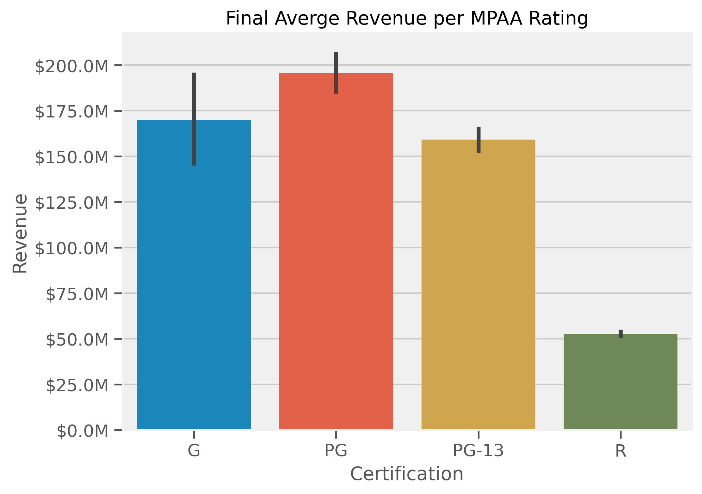

# How to Make a Successful Movie

- James M. Irving


## Business Problem


I have been hired to process and analyze IMDB's extensive publicly-available dataset, supplement it with financial data from TMDB's API, convert the raw data into a MySQL database, and then use that database for extracting insights and recommendations on how to make a successful movie.

I will use a combination of machine-learning-model-based insights and hypothesis testing to extract insights for our stakeholders.


  
### Specifications/Constraints    
- The stakeholder wants to focus on attributes of the movies themselves vs. the actors and directors connected to those movies. 
- They only want to include information related to movies released in the United States.
- They also did not want to include movies released before the year 2000.
- The stakeholder is particularly interested in how the MPAA rating, genre(s), runtime, budget, and production companies influence movie revenue and user ratings.


## `Part 1- Initial IMDB Data Processing.ipynb`

#### IMDB Movie Metadata
- I will download fresh movie metadata from IMDB's public datasets and filter out movies that meet the stakeholder's requirements/constraints.

- IMDB Provides Several Files with varied information for Movies, TV Shows, Made for TV Movies, etc.
    - Overview/Data Dictionary: <a href="https://www.imdb.com/interfaces/" target="_blank">https://www.imdb.com/interfaces/</a>

    - Downloads page: <a href="https://datasets.imdbws.com/" target="_blank">https://datasets.imdbws.com/</a>
- Files to use:
    - title.basics.tsv.gz
    - title.ratings.tsv.gz
    - title.akas.tsv.gz
  

##  `Part 2 - Extracting TMDB Data.ipynb`

### Supplement Data from The Movie Database  (TMDB)'s

- I will extract MPAA rating and financial data for the movies using TMDB's API.


        
 
>"This product uses the TMDB API but is not endorsed or certified by TMDB." 
       


        
### EDA Summary of Extracted Data

### Years Extracted (thus far)

     
### MPAA Rating Counts

### MPAA Rating Revenue Comparison


### MPAA Rating - Average Budget Comparison
  


### MPAA Rating - Average ROI Comparison

        
       

## `Part 3 - MySQL Database Construction`

- I will then normalize all IMDB movie data into a proper MySQL database.
    - MVP Version (included): Local Server Installation with Publicly-Available .sql file for recreationl.
    - AAB Version (future work): AWS-hosted RDS MySQL database. 
- See `SQL` folder for:
    - `movies.sql`: exported SQL DB
    - `movies_project.mwb`: model used for ERD
    

### ERD

    

## `Part 4 - Hypothesis Testing` - WIP


- I will then use the MySQL database to answer several hypotheses about movie success.

### Q1: Do some MPAA Ratings make more revenue than others?

##### Hypothesis
- $H_0$ (Null Hypothesis): All MPAA ratings generate have equal average revenue. 
- $H_A$ (Alternative Hypothesis):  Some MPAA ratings earn significantly more/less revenue than others.

##### Selecting the Right Test
- We have Numerical Data, with more than 2 groups, and therefore want to perform One way ANOVA.

### ANOVA Assumptions
- No significant outliers
- Normality
- Equal Variance


##### Outliers Removed
- There were 2 outliers in the PG-13 group.
- There were 1 outliers in the PG group.
- There were 4 outliers in the R group.
- There were 1 outliers in the G group.

##### Normality Assumption
- We failed a Shapiro's test for normality for several groups and had too small $n$ for G-rated movies to safely ignore asumpton.


- Therefore, we will perform a Kruskal-Wallis test instead of a One Way ANOVA


##### Final Conclusion
- Test Result: `KruskalResult(statistic=29.15915632270992, pvalue=2.0734380490347713e-06)`

>- Our Kruskal Wallis test returned a p-value <.0001. We reject the null hypothesis.
    - There is a significant difference in the average revenue for different movie certifications.
    - A post-hoc determined that movies rated R made significantly less than all other raings.



### Future Work: Planned Hypotheses to Test


- [x] Q1: Does the MPAA rating of a movie (G/PG/PG-13/R) affect how much revenue the movie generates? If so, which rating earns the most revenue?


- Q1B: What if compare ROI instead of revenue?


- Q2; Do movies that are over 2.5 hours long earn more revenue than movies that are 1.5 hours long (or less)?


- Q3: Do movies released in 2020 earn less revenue than movies released in 2018?


- Q4: Do some movie genres earn more revenue than others?


- Q5: Are some genres more highly rated than others?

## `Part 5 - Regression Model-Based Insights` - WIP

- Finally I will use Linear Regression and other machine learning models to predict movie revenue / ROI to extract insights and recommendations on what features of a movie are positive/negative predictors of success.

### Best Model
```
OLS Regression Results                            
==============================================================================
Dep. Variable:                revenue   R-squared:                       0.637
Model:                            OLS   Adj. R-squared:                  0.630
Method:                 Least Squares   F-statistic:                     85.56
Date:                Sat, 21 May 2022   Prob (F-statistic):               0.00
Time:                        22:28:25   Log-Likelihood:                -60226.
No. Observations:                3229   AIC:                         1.206e+05
Df Residuals:                    3163   BIC:                         1.210e+05
Df Model:                          65                                         
Covariance Type:            nonrobust                                         
======================================================================================================
                                         coef    std err          t      P>|t|      [0.025      0.975]
------------------------------------------------------------------------------------------------------
certification_G                    -5.013e+06   3.09e+07     -0.162      0.871   -6.55e+07    5.55e+07
certification_MISSING                  0.6335      0.028     22.276      0.000       0.578       0.689
certification_NC-17                 5.324e+05   6.58e+04      8.085      0.000    4.03e+05    6.61e+05
certification_NR                    1.255e+05   2.88e+04      4.363      0.000    6.91e+04    1.82e+05
certification_PG                   -1.088e+05   5.19e+05     -0.210      0.834   -1.13e+06    9.09e+05
certification_PG-13                 1.218e+04    473.072     25.747      0.000    1.13e+04    1.31e+04
certification_R                    -2.189e+05   1.07e+05     -2.038      0.042    -4.3e+05   -8310.648
adult                              -1.054e+05   1.59e+05     -0.662      0.508   -4.17e+05    2.07e+05
budget                              2.341e+04    6.4e+04      0.366      0.715   -1.02e+05    1.49e+05
popularity                          6.195e+07   2.72e+07      2.278      0.023    8.62e+06    1.15e+08
runtime                             5.291e+07   2.72e+07      1.942      0.052   -5.19e+05    1.06e+08
vote_average                        4.577e+07    2.8e+07      1.637      0.102   -9.04e+06    1.01e+08
vote_count                          5.081e+07   2.73e+07      1.863      0.063   -2.66e+06    1.04e+08
year                                 6.01e+07   2.71e+07      2.219      0.027       7e+06    1.13e+08
month                               5.592e+07    2.7e+07      2.074      0.038    3.05e+06    1.09e+08
day                                 4.456e+07   2.69e+07      1.654      0.098   -8.26e+06    9.74e+07
belongs_to_collection                1.67e+07   1.58e+06     10.563      0.000    1.36e+07    1.98e+07
ProdComp_20th Century Fox           9.646e+06   3.92e+06      2.458      0.014    1.95e+06    1.73e+07
ProdComp_BBC Films                  9.638e+05   5.09e+06      0.189      0.850   -9.01e+06    1.09e+07
ProdComp_Blumhouse Productions      1.456e+07   5.95e+06      2.447      0.014    2.89e+06    2.62e+07
ProdComp_CJ Entertainment             1.6e+07      6e+06      2.664      0.008    4.22e+06    2.78e+07
ProdComp_Canal+                     4.215e+05   3.86e+06      0.109      0.913   -7.14e+06    7.98e+06
ProdComp_Ciné+                       -6.7e+06    6.4e+06     -1.047      0.295   -1.92e+07    5.84e+06
ProdComp_Columbia Pictures          2.052e+07   3.24e+06      6.334      0.000    1.42e+07    2.69e+07
ProdComp_Dimension Films            5.014e+06   5.36e+06      0.936      0.349   -5.49e+06    1.55e+07
ProdComp_DreamWorks Animation       4.437e+07    1.4e+07      3.160      0.002    1.68e+07    7.19e+07
ProdComp_DreamWorks Pictures        9.409e+06    4.3e+06      2.188      0.029    9.77e+05    1.78e+07
ProdComp_Dune Entertainment         1.419e+07   5.58e+06      2.546      0.011    3.26e+06    2.51e+07
ProdComp_Epsilon Motion Pictures   -7.884e+06   6.33e+06     -1.245      0.213   -2.03e+07    4.53e+06
ProdComp_EuropaCorp                -1.165e+07   6.67e+06     -1.745      0.081   -2.47e+07    1.44e+06
ProdComp_Film4 Productions         -6.472e+06    5.5e+06     -1.176      0.240   -1.73e+07    4.32e+06
ProdComp_Focus Features             2.026e+06   4.48e+06      0.452      0.651   -6.76e+06    1.08e+07
ProdComp_Fox 2000 Pictures          1.651e+07   6.93e+06      2.381      0.017    2.92e+06    3.01e+07
ProdComp_Fox Searchlight Pictures  -2.021e+06   4.81e+06     -0.420      0.675   -1.15e+07    7.42e+06
ProdComp_France 2 Cinéma           -1.154e+07    6.2e+06     -1.860      0.063   -2.37e+07    6.25e+05
ProdComp_France 3 Cinéma           -1.394e+06   6.02e+06     -0.232      0.817   -1.32e+07    1.04e+07
ProdComp_Ingenious Media           -5.116e+06   6.49e+06     -0.788      0.431   -1.78e+07    7.61e+06
ProdComp_Legendary Pictures        -5.125e+06   8.51e+06     -0.603      0.547   -2.18e+07    1.16e+07
ProdComp_Lionsgate                 -5.177e+05   3.62e+06     -0.143      0.886   -7.61e+06    6.57e+06
ProdComp_MISSING                     3.23e-09   6.99e-09      0.462      0.644   -1.05e-08    1.69e-08
ProdComp_Metro-Goldwyn-Mayer        6.656e+06   4.56e+06      1.459      0.145   -2.29e+06    1.56e+07
ProdComp_Millennium Films          -6.043e+06   5.23e+06     -1.155      0.248   -1.63e+07    4.22e+06
ProdComp_Miramax                    1.041e+07   4.57e+06      2.280      0.023    1.46e+06    1.94e+07
ProdComp_New Line Cinema            1.999e+07   3.62e+06      5.522      0.000    1.29e+07    2.71e+07
ProdComp_New Regency Pictures       -4.61e+05   8.07e+06     -0.057      0.954   -1.63e+07    1.54e+07
ProdComp_Original Film             -3.267e+06   6.88e+06     -0.475      0.635   -1.68e+07    1.02e+07
ProdComp_Paramount                  1.899e+07   3.22e+06      5.902      0.000    1.27e+07    2.53e+07
ProdComp_Participant                4.634e+06   6.27e+06      0.739      0.460   -7.66e+06    1.69e+07
ProdComp_Regency Enterprises       -1.741e+06   7.34e+06     -0.237      0.812   -1.61e+07    1.26e+07
ProdComp_Relativity Media            9.11e+06   4.07e+06      2.239      0.025    1.13e+06    1.71e+07
ProdComp_Revolution Studios        -1.358e+06    6.2e+06     -0.219      0.827   -1.35e+07    1.08e+07
ProdComp_Scott Free Productions    -3.074e+06   6.64e+06     -0.463      0.643   -1.61e+07    9.94e+06
ProdComp_Scott Rudin Productions    3.177e+05   5.52e+06      0.058      0.954   -1.05e+07    1.11e+07
ProdComp_Screen Gems                1.468e+07   4.62e+06      3.175      0.002    5.61e+06    2.37e+07
ProdComp_Sony Pictures              8.084e+06   4.65e+06      1.740      0.082   -1.02e+06    1.72e+07
ProdComp_Spyglass Entertainment      5.08e+06   6.77e+06      0.751      0.453   -8.19e+06    1.83e+07
ProdComp_StudioCanal                5.524e+06   4.35e+06      1.269      0.205   -3.01e+06    1.41e+07
ProdComp_Summit Entertainment      -2.763e+06   4.66e+06     -0.593      0.553   -1.19e+07    6.38e+06
ProdComp_TF1 Films Production       5.961e+06   7.19e+06      0.829      0.407   -8.14e+06    2.01e+07
ProdComp_TSG Entertainment          9.122e+05   7.01e+06      0.130      0.896   -1.28e+07    1.46e+07
ProdComp_The Weinstein Company     -9.314e+05   5.49e+06     -0.170      0.865   -1.17e+07    9.83e+06
ProdComp_Touchstone Pictures         1.59e+07   4.57e+06      3.483      0.001    6.95e+06    2.49e+07
ProdComp_Universal Pictures         1.381e+07   2.82e+06      4.892      0.000    8.28e+06    1.93e+07
ProdComp_Village Roadshow Pictures  7.873e+06   5.63e+06      1.399      0.162   -3.16e+06    1.89e+07
ProdComp_Walt Disney Pictures       2.679e+07   4.66e+06      5.751      0.000    1.77e+07    3.59e+07
ProdComp_Warner Bros. Pictures      1.684e+06   3.16e+06      0.533      0.594   -4.51e+06    7.88e+06
ProdComp_Working Title Films        1.444e+06   6.35e+06      0.227      0.820    -1.1e+07    1.39e+07
const                                3.72e+08   1.89e+08      1.969      0.049    1.65e+06    7.42e+08
==============================================================================
Omnibus:                      606.983   Durbin-Watson:                   1.992
Prob(Omnibus):                  0.000   Jarque-Bera (JB):             2441.537
Skew:                           0.875   Prob(JB):                         0.00
Kurtosis:                       6.884   Cond. No.                     2.54e+23
==============================================================================

Notes:
[1] Standard Errors assume that the covariance matrix of the errors is correctly specified.
[2] The smallest eigenvalue is 5.63e-29. This might indicate that there are
strong multicollinearity problems or that the design matrix is singular.
```


## Model Coefiicents and Importances

### OLS Coefficients


### Random Forest - Built-in Feature Importance


### Permutation Importance


### Summary
- Coming soon!

