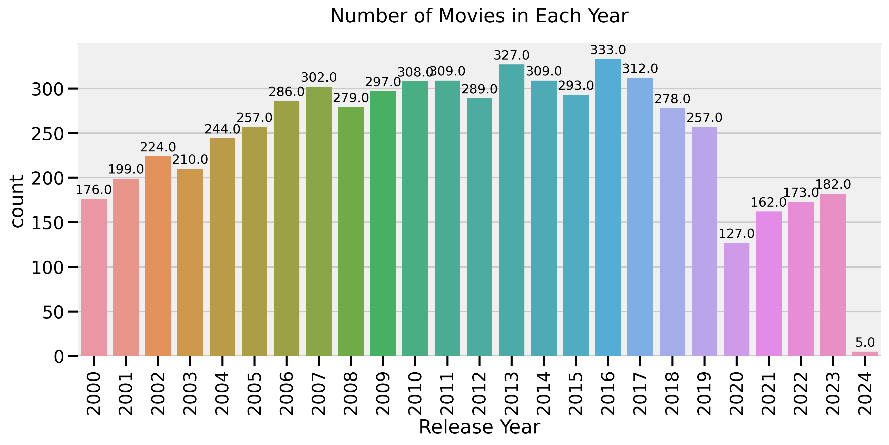
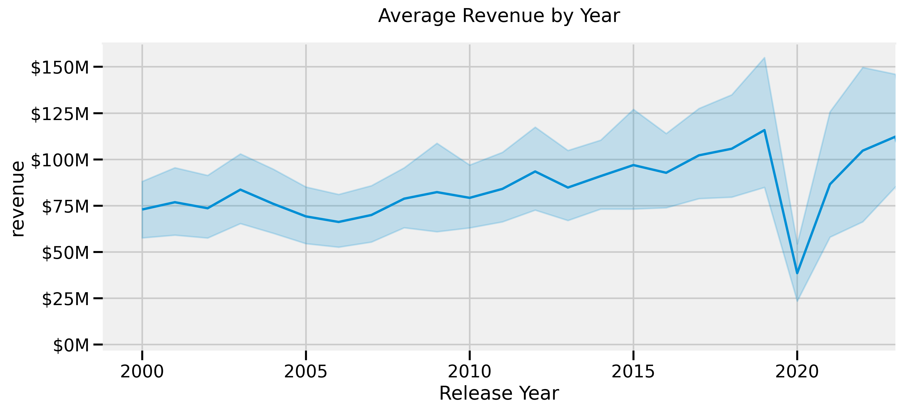
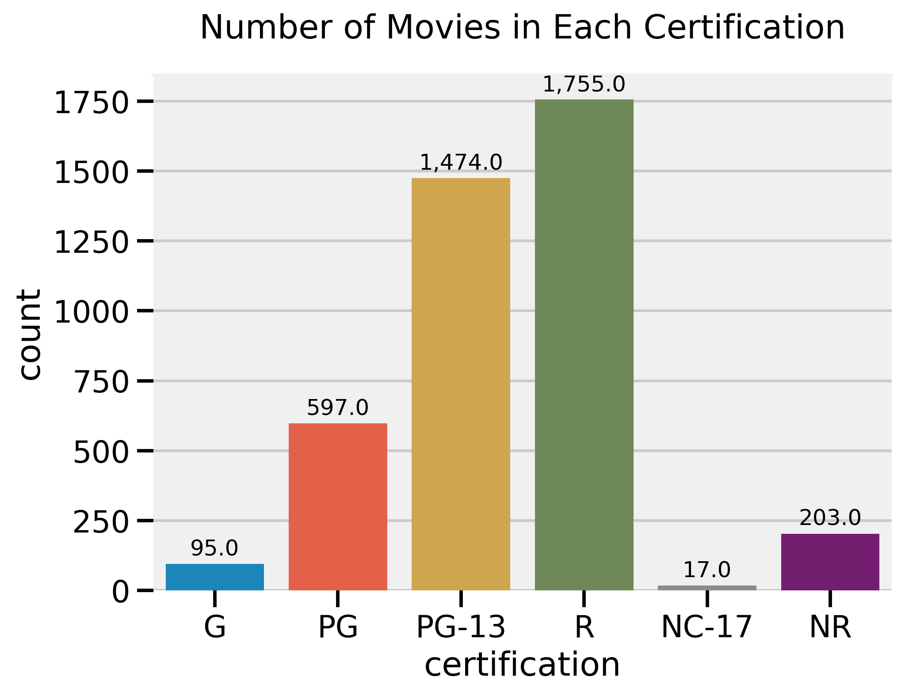
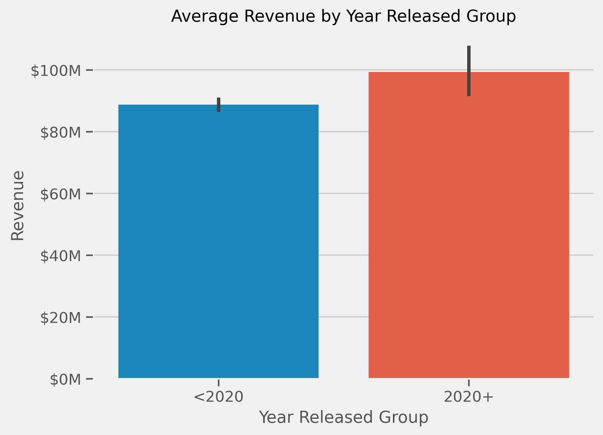
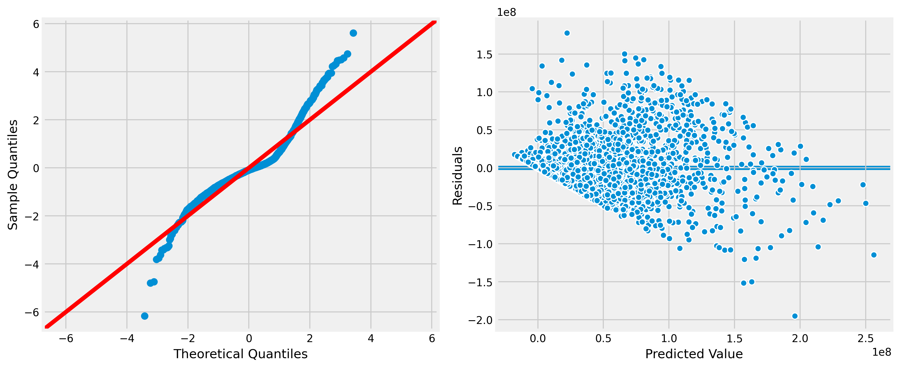

# How to Make a Successful Movie

- James M. Irving, Ph.D.


<blockquote>
    <ul>
  <li><a href="https://www.linkedin.com/in/james-irving-phd" rel="nofollow noreferrer">
     LinkedIn
  </a> </li>
  <li><a href="https://github.com/jirvingphd" rel="nofollow noreferrer">
    Github
  </a></li>
</ul>
</blockquote>

- Updated 02/02/2024

<center></center>

## Business Problem


I have been hired to process and analyze IMDB's extensive publicly-available dataset, supplement it with financial data from TMDB's API, perform ETL on all of the raw data and construct a MySQL database. 

I will then export this mysql database as a collection of csvs for constructing a Tableau dashboard.


I will use a combination of machine-learning-model-based insights and hypothesis testing to extract insights for our stakeholders on how to make a successful movie.


<hr>

### Companion Tableau Dashboard

<center><a href="https://public.tableau.com/views/MovieDashboard_17068360838980/Main?:language=en-US&:display_count=n&:origin=viz_share_link"></a></center>

<blockquote><a href="https://public.tableau.com/views/MovieDashboard_17068360838980/Main?:language=en-US&:display_count=n&:origin=viz_share_link">Click here for the Companion Tableau Dashboard</a></blockquote>

<hr>


<!-- <center></center> -->

# `Part 1- Initial IMDB Data Processing.ipynb`

  
### Specifications/Constraints    
- The stakeholder wants to focus on attributes of the movies themselves vs. the actors and directors connected to those movies. 
- They only want to include information related to movies released in the United States.
- They also did not want to include movies released before the year 2000.
- The stakeholder is particularly interested in how the MPAA rating, genre(s), runtime, budget, and production companies influence movie revenue and user ratings.


#### IMDB Movie Metadata
- I will download fresh movie metadata from IMDB's public datasets and filter out movies that meet the stakeholder's requirements/constraints.

- IMDB Provides Several Files with varied information for Movies, TV Shows, Made for TV Movies, etc.
    - Overview/Data Dictionary: <a href="https://www.imdb.com/interfaces/" target="_blank">https://www.imdb.com/interfaces/</a>

    - Downloads page: <a href="https://datasets.imdbws.com/" target="_blank">https://datasets.imdbws.com/</a>
- Files to use:
    - title.basics.tsv.gz
    - title.ratings.tsv.gz
    - title.akas.tsv.gz
  

#  `Part 2 - Extracting TMDB Data.ipynb`

### Supplement IMDB Data Using The Movie Database  (TMDB)'s API

- I will extract MPAA rating and financial data for the movies using TMDB's API.

___ 


        
 
>"This product uses the TMDB API but is not endorsed or certified by TMDB." 
       


___

        
## EDA Summary of Extracted Data

### Years Extracted



### Average Revenue By Year



### MPAA Rating Counts



### MPAA Rating Revenue Comparison


### MPAA Rating - Average Budget Comparison
  

### MPAA Rating - Average ROI Comparison

        
       

# `Part 3 - MySQL Database Construction`

- I will then normalize all IMDB movie data into a proper MySQL database.
    - MVP Version (included): Local Server Installation with Publicly-Available .sql file for recreationl.
    - AAB Version (disabled): AWS-hosted RDS MySQL database. Disabled due to exceeding AWS monthly budget.
- See `Data-SQL` folder for:
    - `movies.sql`: exported SQL DB
    - `movies_project.mwb`: model used for ERD
    

### ERD


<!--  -->

# `Part 4 - Hypothesis Testing`


## Hypotheses to Test

>- Q1: Does the MPAA rating of a movie (G/PG/PG-13/R) affect how much revenue the movie generates? If so, which rating earns the most revenue?
>- Q2; Do movies that are over 2 hours long earn more or less revenue than movies that are less than 2 hours long?
>- Q3: Do movies released after 2020 earn less revenue than movies released before 2020?
>- Q4: Do some movie genres earn more revenue than others?

### Data for Tests (SQL Queries)

- To answer the questions above, 2 version of the data were extracted from the mysql database.
    - Query 1) Movie Information for Q1-Q3 (one to one join; one row per movie)
    - Query 2) Movie Information for Q4 with genres (one-to-many join; one row per genre per movie)

### Query 1) Movie Certification, Runties, budget, revenue, and metadat


- **SQL Query (For tests exlcuding genres)**
```SQL

SELECT 
    tm.imdb_id,
    tb.primaryTitle,
    tm.release_date,
    tm.certification,
    tb.runtimeMinutes as runtime,
    tm.budget,
    tm.revenue
FROM
    tmdb tm
        JOIN
    title_basics tb ON tm.imdb_id = tb.tconst
WHERE
    tm.budget > 0 AND tm.revenue > 0
        AND tm.certification IS NOT NULL
        AND tm.certification NOT LIKE 'NR'
        AND tm.certification NOT LIKE 'NC%';

```


- **Preview of data:**


|    | imdb_id   | primaryTitle                                           | release_date   | certification   |   runtime |    budget |   revenue |
|---:|:----------|:-------------------------------------------------------|:---------------|:----------------|----------:|----------:|----------:|
|  0 | tt0168629 | Dancer in the Dark                                     | 2000-06-30     | R               |       140 |  12500000 |  45600000 |
|  1 | tt0314412 | My Life Without Me                                     | 2003-03-07     | R               |       106 |   2500000 |  12300000 |
|  2 | tt0325980 | Pirates of the Caribbean: The Curse of the Black Pearl | 2003-07-09     | PG-13           |       143 | 140000000 | 655011224 |
|  3 | tt0266697 | Kill Bill: Vol. 1                                      | 2003-10-10     | R               |       111 |  30000000 | 180906076 |
|  4 | tt0338013 | Eternal Sunshine of the Spotless Mind                  | 2004-03-19     | R               |       108 |  20000000 |  72258126 |


### Query 2) Movie Certification, Runties, budget, revenue, and metadat


- **SQL Query (For tests including genre)**
```SQL

SELECT 
    tm.imdb_id,
    tb.primaryTitle,
    tm.budget,
    tm.revenue,
    g.genre_name
FROM
    tmdb tm
        JOIN
    title_basics tb ON tm.imdb_id = tb.tconst
        JOIN
    title_genres tg ON tg.tconst = tb.tconst
        JOIN
    genres g ON g.genre_id = tg.genre_id
WHERE
    tm.budget > 0 AND tm.revenue > 0
    AND g.genre_name IS NOT NULL
    AND g.genre_name NOT LIKE "News";

```


- **Preview of data:**


|    | imdb_id   | primaryTitle   |   budget |   revenue | genre_name   |
|---:|:----------|:---------------|---------:|----------:|:-------------|
|  0 | tt0035423 | Kate & Leopold | 48000000 |  76019048 | Comedy       |
|  1 | tt0035423 | Kate & Leopold | 48000000 |  76019048 | Fantasy      |
|  2 | tt0035423 | Kate & Leopold | 48000000 |  76019048 | Romance      |
|  3 | tt0118589 | Glitter        | 22000000 |   5271666 | Drama        |
|  4 | tt0118589 | Glitter        | 22000000 |   5271666 | Music        |


## Hypothesis Testing Workflow 

#### Step 1: Select the Appropriate Hypothesis Test

- Q1: What type of data do I have (Numeric or categorical?)
- Q2: How many samples/groups am I comparing?

>Using the answers to the above 2 questions: select the type of test from this table.

| What type of comparison? | Numeric Data | Categorical Data|
| --- | --- | --- |
|Sample vs Known Quantity/Target|1 Sample T-Test| Binomial Test|
|2 Samples | 2 Sample T-Test| Chi-Square|
|More than 2| ANOVA and/or Tukey | Chi Square|

#### STEP 2:  Do we meet the assumptions of the chosen test?

- [One-Sample T-Test](https://statistics.laerd.com/spss-tutorials/one-sample-t-test-using-spss-statistics.php)
    - No significant outliers
    - Normality

- [Independent t-test (2-sample)](https://statistics.laerd.com/statistical-guides/independent-t-test-statistical-guide.php)
    - No significant outliers
    - Normality
    - Equal Variance

- [One Way ANOVA](https://statistics.laerd.com/spss-tutorials/one-way-anova-using-spss-statistics.php)
    - No significant outliers
    - Equal variance
    - Normality

- [Chi-Square test](https://statistics.laerd.com/spss-tutorials/chi-square-test-for-association-using-spss-statistics.php)
    - Both variables are categorical

 
|Assumption test| Function |
| --- | --- |
| **Normality**| `scipy.stats.shapiro`|
| **Equal Variance** | `scipy.stats.levene`|


#### Step 3: Select Final Test Based on Checking Assumptions 

If we meet all of the assumptions, we can use 

> **Table Source: Parametric  T-Tests vs Non-Parametric Alternatives**
- [Choosing Between Parametric and Non-Parametric Tests](https://blog.minitab.com/blog/adventures-in-statistics-2/choosing-between-a-nonparametric-test-and-a-parametric-test)

- **Select the test from the right Nonparametric column that matches your Parametric t-test.** 

<!-- | Parametric tests (means) | Nonparametric tests (medians) |
 | --- | --- |
 | 1-sample t test | 1-sample Wilcoxon |
 | 2-sample t test | Mann-Whitney U test |
 | One-Way ANOVA | Kruskal-Wallis |
 -->

| Parametric tests (means) | Function | Nonparametric tests (medians) | Function |
 | --- | --- | --- | --- |
 | **1-sample t test** |`scipy.stats.ttest_1samp()`|  **1-sample Wilcoxon** |`scipy.stats.wilcoxon`|
 | **2-sample t test** |`scipy.stats.ttest_ind()` | **Mann-Whitney U test** |`scipy.stats.mannwhitneyu()` |
 | **One-Way ANOVA** | `scipy.stats.f_oneway()` | **Kruskal-Wallis** | `scipy.stats.kruskal` | 
 

- Perform the selected test to obtain the p-value to interpret.


#### STEP 4 Interpret Result & Post-Hoc Tests


- If p value is < $\alpha$:
    - Reject the null hypothesis.
    - Calculate effect size (e.g. Cohen's $d$)
    
- If p<.05 AND you have multiple groups (i.e. ANOVA)
    - Perform a pairwise Tukey's  Multiuple Comparison test to determine which groups were significantly different.
    - [Tukey pairwise comparison test](https://www.statsmodels.org/stable/generated/statsmodels.stats.multicomp.pairwise_tukeyhsd.html)
    - `statsmodels.stats.multicomp.pairwise_tukeyhsd`
    

## Q1: # Q1: Does MPAA rating affec average revenue?

### Hypothesis
- $H_0$ (Null Hypothesis): All MPAA ratings generate have equal average revenue. 
- $H_A$ (Alternative Hypothesis):  Some MPAA ratings earn significantly more/less revenue than others.

### Selecting the Right Test
- We have Numerical Data
- with more than 2 groups
- We want a One way ANOVA

### ANOVA Assumptions
- No significant outliers
- Normality
- Equal Variance

#### Normality Assumption

| group   |    n |    stat |           p |   p (.4) | sig?   |
|:--------|-----:|--------:|------------:|---------:|:-------|
| G       |   76 | 0.71435 | 7.28273e-11 |        0 | True   |
| PG      |  528 | 0.68657 | 4.01101e-30 |        0 | True   |
| PG-13   | 1374 | 0.58601 | 0           |        0 | True   |
| R       | 1602 | 0.57287 | 0           |        0 | True   |

- Didn't meet assumption of normality, but group n's are sufficiently large to safely disregard assumption of normality.

##### Outliers Removed

- The following outliers were removed from the analysis using the Z-score method.
  
| group   |   n (original) |   # outliers | % outliers   |   n (final) |
|:--------|---------------:|-------------:|:-------------|------------:|
| G       |             76 |            2 | 2.63%        |          74 |
| PG      |            528 |           13 | 2.46%        |         515 |
| PG-13   |           1374 |           30 | 2.18%        |        1344 |
| R       |           1602 |           36 | 2.25%        |        1566 |

#### Assumption of Equal Variance

```
LeveneResult(statistic=114.28641279259686, pvalue=1.3454791463102724e-70)
```
Groups do not have equal variance. 

#### Final Test Selection

- Since we failed the assumption of equal variance, we will use the non-parametric Kruskal Wallis instead of one-way ANOVA.

### Hypothsis Test Results

- Test Result:
```
KruskalResult(statistic=475.2106095783153, pvalue=1.1236250591779874e-102)
```

>- Our Kruskal Wallis test returned a p-value <.0001. Therefore, we reject the null hypothesis.
    - We conclude that there is a significant difference in the average revenue for different movie certifications.
    - We must perform a pairwise Tukey's Multiple Comparison test to identify which ratings were significantly different.


#### Post-Hoc Comparisons

```
            Multiple Comparison of Means - Tukey HSD, FWER=0.05            
===========================================================================
group1 group2     meandiff    p-adj       lower           upper      reject
---------------------------------------------------------------------------
     G     PG   22365342.1324 0.6143  -24763540.9256   69494225.1903  False
     G  PG-13  -13536296.5139 0.8686  -58802241.9315   31729648.9037  False
     G      R -103245893.7041    0.0 -148344088.6404  -58147698.7679   True
    PG  PG-13  -35901638.6462    0.0  -55548148.9444   -16255128.348   True
    PG      R -125611235.8365    0.0 -144868097.9603 -106354373.7126   True
 PG-13      R  -89709597.1902    0.0 -103805729.1106  -75613465.2699   True
---------------------------------------------------------------------------
```
### Final Interpretation

>- According to the post-hoc Tukey's tests, G/PG/PG-13 movies make similar average revenue than all other ratings. However, PG movies make more money than PG-13.
>- R-rated movied make significantly less revenue than every other genre!


## Q2: Do movies that are over 2 hours long earn more or less revenue than movies that are less than 2 hours long?


## Hypothesis
- $H_0$ (Null Hypothesis): Movies longer than 2 hours generate the same average revenue as shorter movies.
- $H_A$ (Alternative Hypothesis):  Movies longer than 2 hours generate more/less average revenue than shorter movies.

### Selecting the Right Test
- We have Numerical Data
- with 2 groups
- 2-sample t-test A.K.A. Independent T-Test

### T-Test Assumptions
- No significant outliers
- Normality
- Equal Variance

#### Normality Assumption

| group    |    n |    stat |          p |   p (.4) | sig?   |
|:---------|-----:|--------:|-----------:|---------:|:-------|
| 2+ hours |  664 | 0.68894 | 3.4863e-33 |        0 | True   |
| <2 hours | 2916 | 0.57219 | 0          |        0 | True   |

- We didn't meet assumption of normality, but n is sufficiently large to disregard assumption of normality.


#### Outliers Removed

- The following outliers were removed from the analysis using the Z-score method.
  
| group    |   n (original) |   # outliers | % outliers   |   n (final) |
|:---------|---------------:|-------------:|:-------------|------------:|
| 2+ hours |            664 |           11 | 1.66%        |         653 |
| <2 hours |           2916 |           65 | 2.23%        |        2851 |

#### Assumption of Equal Variance
```
LeveneResult(statistic=527.872338946773, pvalue=6.35084984584201e-109)
```
- The groups do NOT have equal variance. 

#### Final Test Selection

- Since we failed the assumption of equal variance, we will use Mann Whitney U test instead of a a 2-sample t-test.

### Hypothsis Test Results

- Test Result:
```
MannwhitneyuResult(statistic=1312978.5, pvalue=2.3697632561755602e-60)
```

>- Our Mann-Whitney U-test returned a significant p-value (p<.001), therefore we reject the null hypothesis that movie movies longer than 2 hours earn the same average revenue as shorter movies.


### Final Interpretation
>- Movies with long runtimes (2+ hours) earn significantly more revenue than movies less than 2 hours long.


## Q3: Do movies released after 2020 earn less revenue than movies released before 2020?


## Hypothesis
- $H_0$ (Null Hypothesis): Movies released before 2020 earn the same revenue as movies released during or after 2020.
- $H_A$ (Alternative Hypothesis): Movies released before 2020 earn more revenue than movies released during or after 2020.

### Selecting the Right Test
- We have Numerical Data
- with 2 groups
- 2-sample t-test A.K.A. Independent T-Test

### T-Test Assumptions
- No significant outliers
- Normality
- Equal Variance

#### Normality Assumption

| group   |    n |    stat |           p |   p (.4) | sig?   |
|:--------|-----:|--------:|------------:|---------:|:-------|
| 2020+   |  365 | 0.51698 | 2.28204e-30 |        0 | True   |
| <2020   | 3215 | 0.54951 | 0           |        0 | True   |

- We didn't meet assumption of normality, but n is sufficiently large to disregard assumption of normality.


#### Outliers Removed

- The following outliers were removed from the analysis using the Z-score method.
  
| group   |   n (original) |   # outliers | % outliers   |   n (final) |
|:--------|---------------:|-------------:|:-------------|------------:|
| 2020+   |            365 |            9 | 2.47%        |         356 |
| <2020   |           3215 |           90 | 2.80%        |        3125 |

#### Assumption of Equal Variance

```
LeveneResult(statistic=3.2007677957173684, pvalue=0.07369067470860166)
```
- Levene's test returned p-value >.05, therefore we conclude that the groups DO indeed have equal variance.

#### Final Test Selection

-  Since goups have equal variance and we had sufficient n's to safely ignore the assumption of normality,  we will therefore run planned 2-sample T-test.

### Hypothsis Test Results

- Test Result:
```
Ttest_indResult(statistic=-1.4403686474133954, pvalue=0.14985311221809952)
```

>- Our 2-sample T-test had a p-value=.14, so we fail to reject the null hypothesis that movies released after 2020 earn less average revenue than movies released before 2020. 


### Final Interpretation
>- Movies released after 2020 earn similar average revenue as movies pre-2020.  



## Q4: Do some movie genres earn more revenue than others?

### Hypothesis
- $H_0$ (Null Hypothesis): All genres earn the same average revenue.
- $H_A$ (Alternative Hypothesis): Some genres earn significantly more or less revenue than others.

### Selecting the Right Test
- We have Numerical Data
- with >2 groups
- One-Way ANOVA

### ANOVA Assumptions
- No significant outliers
- Normality
- Equal Variance

#### Normality Assumption

| group       |    n |    stat |           p |   p (.4) | sig?   |
|:------------|-----:|--------:|------------:|---------:|:-------|
| Action      | 1251 | 0.64001 | 2.8026e-45  |        0 | True   |
| Adventure   |  998 | 0.73643 | 5.09555e-37 |        0 | True   |
| Animation   |  284 | 0.81092 | 6.76274e-18 |        0 | True   |
| Biography   |  358 | 0.55211 | 3.11521e-29 |        0 | True   |
| Comedy      | 1690 | 0.58826 | 0           |        0 | True   |
| Crime       |  810 | 0.51515 | 2.6933e-42  |        0 | True   |
| Documentary |  103 | 0.4832  | 2.33071e-17 |        0 | True   |
| Drama       | 2275 | 0.43823 | 0           |        0 | True   |
| Family      |  270 | 0.66299 | 8.07008e-23 |        0 | True   |
| Fantasy     |  352 | 0.59515 | 7.26684e-28 |        0 | True   |
| History     |  157 | 0.50536 | 7.11757e-21 |        0 | True   |
| Horror      |  586 | 0.68522 | 1.38515e-31 |        0 | True   |
| Music       |  155 | 0.52749 | 2.51409e-20 |        0 | True   |
| Musical     |   42 | 0.6486  | 8.86162e-09 |        0 | True   |
| Mystery     |  522 | 0.6905  | 8.043e-30   |        0 | True   |
| Romance     |  707 | 0.67684 | 1.40104e-34 |        0 | True   |
| Sci-Fi      |  346 | 0.70632 | 3.55921e-24 |        0 | True   |
| Sport       |  107 | 0.72344 | 6.64258e-13 |        0 | True   |
| Thriller    |  775 | 0.56898 | 6.86069e-40 |        0 | True   |
| War         |   57 | 0.63047 | 1.01374e-10 |        0 | True   |
| Western     |   19 | 0.57144 | 2.31172e-06 |        0 | True   |


- We didn't meet assumption of normality, but group n's are sufficiently large enough to safely disregard assumption of normality.


##### Outliers Removed

- The following outliers were removed from the analysis using the Z-score method.

| group       |   n (original) |   # outliers | % outliers   |   n (final) |
|:------------|---------------:|-------------:|:-------------|------------:|
| Action      |           1251 |           26 | 2.08%        |        1225 |
| Adventure   |            998 |           16 | 1.60%        |         982 |
| Animation   |            284 |            5 | 1.76%        |         279 |
| Biography   |            358 |            6 | 1.68%        |         352 |
| Comedy      |           1690 |           42 | 2.49%        |        1648 |
| Crime       |            810 |           11 | 1.36%        |         799 |
| Documentary |            103 |            2 | 1.94%        |         101 |
| Drama       |           2275 |           38 | 1.67%        |        2237 |
| Family      |            270 |           10 | 3.70%        |         260 |
| Fantasy     |            352 |            7 | 1.99%        |         345 |
| History     |            157 |            4 | 2.55%        |         153 |
| Horror      |            586 |           11 | 1.88%        |         575 |
| Music       |            155 |            3 | 1.94%        |         152 |
| Musical     |             42 |            1 | 2.38%        |          41 |
| Mystery     |            522 |           12 | 2.30%        |         510 |
| Romance     |            707 |           20 | 2.83%        |         687 |
| Sci-Fi      |            346 |            8 | 2.31%        |         338 |
| Sport       |            107 |            2 | 1.87%        |         105 |
| Thriller    |            775 |           18 | 2.32%        |         757 |
| War         |             57 |            3 | 5.26%        |          54 |
| Western     |             19 |            1 | 5.26%        |          18 |

#### Assumption of Equal Variance

```
LeveneResult(statistic=108.42043594386612, pvalue=0.0)
```
Groups do NOT have equal variance. 

#### Final Test Selection

- Since we failed the assumption of equal variance, we will use the non-parametric Kruskal Wallis instead of one-way ANOVA.

### Hypothsis Test Results

- Test Result:
```
KruskalResult(statistic=1322.232973478133, pvalue=5.122009908940558e-268)
```

>- Our Kruskal Wallis test returned a p-value<.0001, so we reject the null hypothesis that all genres earn the same average revenue.
>- We must peform a Tukey's Pairwise Multiple Comparison Test to confirm which groups are significantly different.


#### Post-Hoc Comparisons

> Note: the full results table is too large to display here, so  we will use the built-in diagnostic plot to visualize significant difference.


> We can see that there are many pairs of significant comparisons between genres. We will focus on examining the significance of the Genres with the highest average revenue.

### Tukey's Results - Highlighted Comparisons

> In the graphs below, the group being compared vs. the other groups is annotated in blue. 
Any groups that were signficantly different from this group will be annotated in red. Any groups that were statistically similarly will be in light gray.

#### Animation & Adventure

> Below, we can see that both Animation and Adventure generate significantly more revenue than all other genres(but are not different vs. each other).

##### Animation vs. All


##### Adventure vs. All


#### Sci-Fi  & Fantasy & Action

> Sci-Fi and Fantasy are the next-highest average revenue (but are not differnent vs. each other).
Below, we can see that both Sci-Fi and Fantasy generate significantly more revenue than many other genres, but they are not different vs. each other.


##### Sci-Fi vs. All


##### Fantasy vs. All


##### Action vs. All
Finally, action is the next most highest earning genre that is statistically significant vs the other genres, except for 


We can see that Adventure and Action movies generate significantly more revenue than all others (but are not different vs. each other). 

### Final Interpretation

>- According to the post-hoc Tukey's tests, there are many gnere differneces in average revenue, but the 5 significantly more successful genres were: Animation, Adventure, Sci-Fi, Fantasy, and Action.

## Hypothesis Testing Summary &  Recommendations

Our recommendations for how to produce a successful move, nased on the results of our hypothesis tests are the following:

1) MPAA-Rating/Certification:  Make a movie that is rated either "PG" or "PG-13" (definitely not "R")!
2) Runtime: Make a movie that is longer than 2 hours.
3) Release Year: Average Revenue in the post-COVID years has not significantly changed vs. pre-pandemic. If you were waiting due to fears about covid-related lost revenue, stop waiting and start making movies!
4) Genres: Make a movie in the following genres:
    1.  Animation
    2.  Adventure
    3.  Sci-Fi
    4.  Fantasy

___

## TO DO: Update Remaining Machine-Learning Modeling and Related Insights:
___

- Update the machine learning analysis to get fresh results with the full 2024 dataset.

## `Part 5 - Regression Model-Based Insights` - WIP

>Note: Previous Results with smaller dataset are below.

- Finally I will use Linear Regression and other machine learning models to predict movie revenue / ROI to extract insights and recommendations on what features of a movie are positive/negative predictors of success.

### Best Model
```
OLS Regression Results                            
==============================================================================
Dep. Variable:                revenue   R-squared:                       0.637
Model:                            OLS   Adj. R-squared:                  0.630
Method:                 Least Squares   F-statistic:                     85.56
Date:                Sat, 21 May 2022   Prob (F-statistic):               0.00
Time:                        22:28:25   Log-Likelihood:                -60226.
No. Observations:                3229   AIC:                         1.206e+05
Df Residuals:                    3163   BIC:                         1.210e+05
Df Model:                          65                                         
Covariance Type:            nonrobust                                         
======================================================================================================
                                         coef    std err          t      P>|t|      [0.025      0.975]
------------------------------------------------------------------------------------------------------
certification_G                    -5.013e+06   3.09e+07     -0.162      0.871   -6.55e+07    5.55e+07
certification_MISSING                  0.6335      0.028     22.276      0.000       0.578       0.689
certification_NC-17                 5.324e+05   6.58e+04      8.085      0.000    4.03e+05    6.61e+05
certification_NR                    1.255e+05   2.88e+04      4.363      0.000    6.91e+04    1.82e+05
certification_PG                   -1.088e+05   5.19e+05     -0.210      0.834   -1.13e+06    9.09e+05
certification_PG-13                 1.218e+04    473.072     25.747      0.000    1.13e+04    1.31e+04
certification_R                    -2.189e+05   1.07e+05     -2.038      0.042    -4.3e+05   -8310.648
adult                              -1.054e+05   1.59e+05     -0.662      0.508   -4.17e+05    2.07e+05
budget                              2.341e+04    6.4e+04      0.366      0.715   -1.02e+05    1.49e+05
popularity                          6.195e+07   2.72e+07      2.278      0.023    8.62e+06    1.15e+08
runtime                             5.291e+07   2.72e+07      1.942      0.052   -5.19e+05    1.06e+08
vote_average                        4.577e+07    2.8e+07      1.637      0.102   -9.04e+06    1.01e+08
vote_count                          5.081e+07   2.73e+07      1.863      0.063   -2.66e+06    1.04e+08
year                                 6.01e+07   2.71e+07      2.219      0.027       7e+06    1.13e+08
month                               5.592e+07    2.7e+07      2.074      0.038    3.05e+06    1.09e+08
day                                 4.456e+07   2.69e+07      1.654      0.098   -8.26e+06    9.74e+07
belongs_to_collection                1.67e+07   1.58e+06     10.563      0.000    1.36e+07    1.98e+07
ProdComp_20th Century Fox           9.646e+06   3.92e+06      2.458      0.014    1.95e+06    1.73e+07
ProdComp_BBC Films                  9.638e+05   5.09e+06      0.189      0.850   -9.01e+06    1.09e+07
ProdComp_Blumhouse Productions      1.456e+07   5.95e+06      2.447      0.014    2.89e+06    2.62e+07
ProdComp_CJ Entertainment             1.6e+07      6e+06      2.664      0.008    4.22e+06    2.78e+07
ProdComp_Canal+                     4.215e+05   3.86e+06      0.109      0.913   -7.14e+06    7.98e+06
ProdComp_Ciné+                       -6.7e+06    6.4e+06     -1.047      0.295   -1.92e+07    5.84e+06
ProdComp_Columbia Pictures          2.052e+07   3.24e+06      6.334      0.000    1.42e+07    2.69e+07
ProdComp_Dimension Films            5.014e+06   5.36e+06      0.936      0.349   -5.49e+06    1.55e+07
ProdComp_DreamWorks Animation       4.437e+07    1.4e+07      3.160      0.002    1.68e+07    7.19e+07
ProdComp_DreamWorks Pictures        9.409e+06    4.3e+06      2.188      0.029    9.77e+05    1.78e+07
ProdComp_Dune Entertainment         1.419e+07   5.58e+06      2.546      0.011    3.26e+06    2.51e+07
ProdComp_Epsilon Motion Pictures   -7.884e+06   6.33e+06     -1.245      0.213   -2.03e+07    4.53e+06
ProdComp_EuropaCorp                -1.165e+07   6.67e+06     -1.745      0.081   -2.47e+07    1.44e+06
ProdComp_Film4 Productions         -6.472e+06    5.5e+06     -1.176      0.240   -1.73e+07    4.32e+06
ProdComp_Focus Features             2.026e+06   4.48e+06      0.452      0.651   -6.76e+06    1.08e+07
ProdComp_Fox 2000 Pictures          1.651e+07   6.93e+06      2.381      0.017    2.92e+06    3.01e+07
ProdComp_Fox Searchlight Pictures  -2.021e+06   4.81e+06     -0.420      0.675   -1.15e+07    7.42e+06
ProdComp_France 2 Cinéma           -1.154e+07    6.2e+06     -1.860      0.063   -2.37e+07    6.25e+05
ProdComp_France 3 Cinéma           -1.394e+06   6.02e+06     -0.232      0.817   -1.32e+07    1.04e+07
ProdComp_Ingenious Media           -5.116e+06   6.49e+06     -0.788      0.431   -1.78e+07    7.61e+06
ProdComp_Legendary Pictures        -5.125e+06   8.51e+06     -0.603      0.547   -2.18e+07    1.16e+07
ProdComp_Lionsgate                 -5.177e+05   3.62e+06     -0.143      0.886   -7.61e+06    6.57e+06
ProdComp_MISSING                     3.23e-09   6.99e-09      0.462      0.644   -1.05e-08    1.69e-08
ProdComp_Metro-Goldwyn-Mayer        6.656e+06   4.56e+06      1.459      0.145   -2.29e+06    1.56e+07
ProdComp_Millennium Films          -6.043e+06   5.23e+06     -1.155      0.248   -1.63e+07    4.22e+06
ProdComp_Miramax                    1.041e+07   4.57e+06      2.280      0.023    1.46e+06    1.94e+07
ProdComp_New Line Cinema            1.999e+07   3.62e+06      5.522      0.000    1.29e+07    2.71e+07
ProdComp_New Regency Pictures       -4.61e+05   8.07e+06     -0.057      0.954   -1.63e+07    1.54e+07
ProdComp_Original Film             -3.267e+06   6.88e+06     -0.475      0.635   -1.68e+07    1.02e+07
ProdComp_Paramount                  1.899e+07   3.22e+06      5.902      0.000    1.27e+07    2.53e+07
ProdComp_Participant                4.634e+06   6.27e+06      0.739      0.460   -7.66e+06    1.69e+07
ProdComp_Regency Enterprises       -1.741e+06   7.34e+06     -0.237      0.812   -1.61e+07    1.26e+07
ProdComp_Relativity Media            9.11e+06   4.07e+06      2.239      0.025    1.13e+06    1.71e+07
ProdComp_Revolution Studios        -1.358e+06    6.2e+06     -0.219      0.827   -1.35e+07    1.08e+07
ProdComp_Scott Free Productions    -3.074e+06   6.64e+06     -0.463      0.643   -1.61e+07    9.94e+06
ProdComp_Scott Rudin Productions    3.177e+05   5.52e+06      0.058      0.954   -1.05e+07    1.11e+07
ProdComp_Screen Gems                1.468e+07   4.62e+06      3.175      0.002    5.61e+06    2.37e+07
ProdComp_Sony Pictures              8.084e+06   4.65e+06      1.740      0.082   -1.02e+06    1.72e+07
ProdComp_Spyglass Entertainment      5.08e+06   6.77e+06      0.751      0.453   -8.19e+06    1.83e+07
ProdComp_StudioCanal                5.524e+06   4.35e+06      1.269      0.205   -3.01e+06    1.41e+07
ProdComp_Summit Entertainment      -2.763e+06   4.66e+06     -0.593      0.553   -1.19e+07    6.38e+06
ProdComp_TF1 Films Production       5.961e+06   7.19e+06      0.829      0.407   -8.14e+06    2.01e+07
ProdComp_TSG Entertainment          9.122e+05   7.01e+06      0.130      0.896   -1.28e+07    1.46e+07
ProdComp_The Weinstein Company     -9.314e+05   5.49e+06     -0.170      0.865   -1.17e+07    9.83e+06
ProdComp_Touchstone Pictures         1.59e+07   4.57e+06      3.483      0.001    6.95e+06    2.49e+07
ProdComp_Universal Pictures         1.381e+07   2.82e+06      4.892      0.000    8.28e+06    1.93e+07
ProdComp_Village Roadshow Pictures  7.873e+06   5.63e+06      1.399      0.162   -3.16e+06    1.89e+07
ProdComp_Walt Disney Pictures       2.679e+07   4.66e+06      5.751      0.000    1.77e+07    3.59e+07
ProdComp_Warner Bros. Pictures      1.684e+06   3.16e+06      0.533      0.594   -4.51e+06    7.88e+06
ProdComp_Working Title Films        1.444e+06   6.35e+06      0.227      0.820    -1.1e+07    1.39e+07
const                                3.72e+08   1.89e+08      1.969      0.049    1.65e+06    7.42e+08
==============================================================================
Omnibus:                      606.983   Durbin-Watson:                   1.992
Prob(Omnibus):                  0.000   Jarque-Bera (JB):             2441.537
Skew:                           0.875   Prob(JB):                         0.00
Kurtosis:                       6.884   Cond. No.                     2.54e+23
==============================================================================

Notes:
[1] Standard Errors assume that the covariance matrix of the errors is correctly specified.
[2] The smallest eigenvalue is 5.63e-29. This might indicate that there are
strong multicollinearity problems or that the design matrix is singular.
```



## Model Coefiicents and Importances

### OLS Coefficients


### Random Forest - Built-in Feature Importance


### Permutation Importance


### Model-Based-Insights Summary

In this project, I have processed, analyzed, and modeled a large dataset of movie data from IMDB and TMDB. I identified several statistically significant relationships between movie attributes and both revenue and user ratings.


Here are some of the key insights gained from this analysis:

* MPAA rating significantly impacts movie revenue. R-rated movies tend to generate less revenue than G, PG, or PG-13 rated movies.
* Movie runtime also significantly impacts revenue. Movies over 2 hours tend to generate more revenue than shorter movies.
  
* Movie budget is a significant predictor of revenue, but the relationship is not linear. Movies with budgets between \$50 million and \$150 million tend to generate the most revenue.
* Movie release month and day have a small but statistically significant impact on revenue. Summer-released movies tend to generate more revenue than movies released in other seasons.
* Production companies involved in making a movie can also significantly impact revenue. Movies produced by certain companies, such as DreamWorks Animation and Pixar, tend to generate more revenue than movies produced by other companies.

These insights can be used by movie studios and distributors to make informed decisions about how to produce and market their movies. For example, studios may want to focus on producing R-rated movies that are shorter, have larger budgets, and are released in the summer. Studios may also want to partner with production companies that have a proven track record of success.


In addition to these insights, I have also developed a regression model that can be used to predict the revenue of a movie based on its attributes. This model can be used by studios and distributors to estimate the potential revenue of a movie before it is released.
